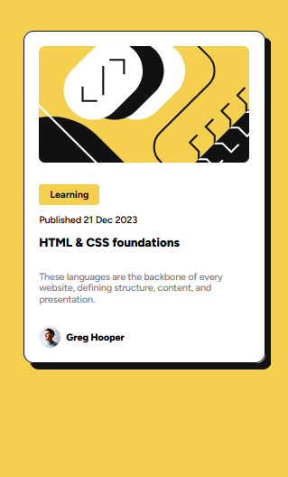
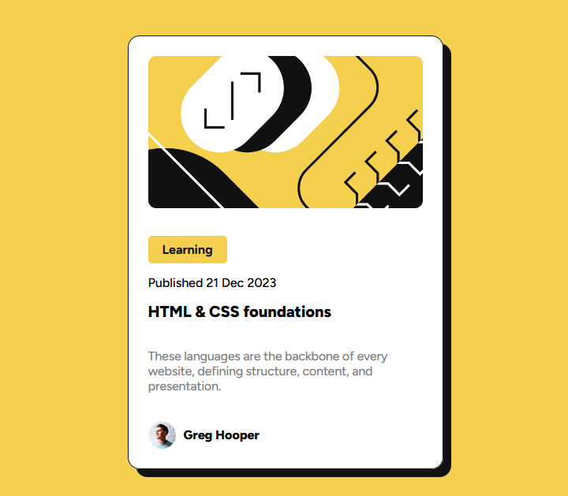

# Frontend Mentor - Blog preview card solution

This is a solution to the [Blog preview card challenge on Frontend Mentor](https://www.frontendmentor.io/challenges/blog-preview-card-ckPaj01IcS). Frontend Mentor challenges help you improve your coding skills by building realistic projects. 

## Table of contents

- [Overview](#overview)
  - [The challenge](#the-challenge)
  - [Screenshots](#screenshot)
  - [Links](#links)
- [My process](#my-process)
  - [Built with](#built-with)
- [Author](#author)

## Overview

### The challenge

Users should be able to:

- See hover and focus states for all interactive elements on the page

## Screenshot
### Mobile

### Desktop

### Links

- Solution URL: [Frontend Mentor Solution](https://www.frontendmentor.io/solutions/frontend-mentor-blog-preview-card-ZRJ8faWNVk)
- Live Site URL: [Demo](https://juanblancodev.github.io/blog-preview-card/)

## My process

### Built with

- Semantic HTML5 markup
- CSS custom properties
- Flexbox
- CSS Grid
- Mobile-first workflow
- [React](https://reactjs.org/) - JS library
- [Styled Components](https://styled-components.com/) - For styles
## Author

- GitHub - [JuanBlancodev](https://github.com/JuanBlancodev)
- Frontend Mentor - [@JuanBlancodev](https://www.frontendmentor.io/profile/JuanBlancodev)
